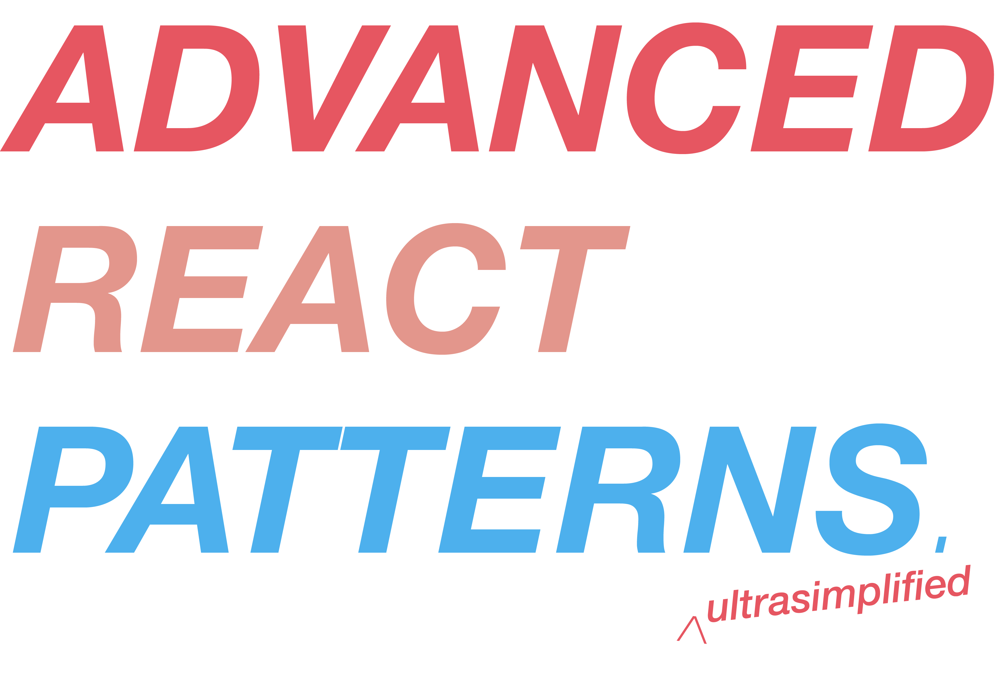
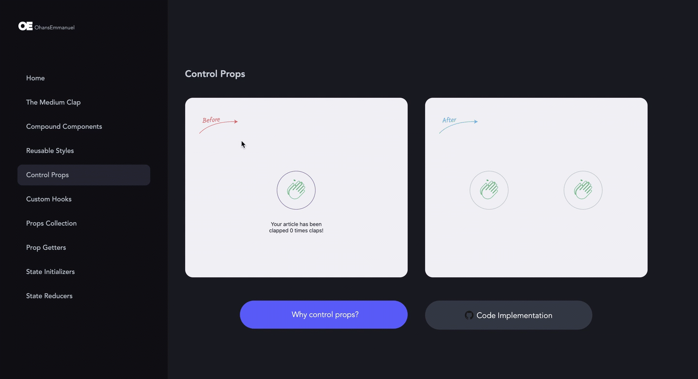

**Welcome to Advanced React Patterns Ultrasimplified!**

Here, I'll walk you through advanced react component patterns in an intuitive fashion that models your day-to-day job as a Software Engineer - Pull requests!

### 🖥 Want to see the demo site? 👉 [advanced-react-patterns-ultrasimplified.netlify.com](https://advanced-react-patterns-ultrasimplified.netlify.com/)

### 👀 Want to see the udemy course? 👉 [https://www.udemy.com/course/the-complete-guide-to-advanced-react-patterns/](https://www.udemy.com/course/the-complete-guide-to-advanced-react-patterns/)

---

## What do you mean by 'Ultrasimplified'?

### 1. Real World Demos 🚀

You won't find basic hello world demos here. The demos have been intentionally designed to be actually helpful and **relatable**.



### 2. Mimics your day-to-day job as a developer 🖥

Each pattern is implemented and discussed via **a pull request**. **View** the PRs. **Read** the descriptions. Read the **comments**. Like you do at work!

## Coming from my [Udemy Course](https://www.udemy.com/course/the-complete-guide-to-advanced-react-patterns/)?

- The branch we start off from is branch `clean-slate`. [See branch](https://github.com/ohansemmanuel/advanced-react-patterns-ultrasimplified/tree/clean-slate)
- Every lesson starts off in a new "clean-slate" branch e.g. "clean-slate-01", "clean-slate-02", "clean-slate-03" etc.

* The development DEMO site lives here: https://dev-advanced-react-patterns-ultrasimplified.netlify.com/

## But I'm just a beginner. Isn't this too advanced?

Every implementation is well explained with comments, diagrams and notes (in progress). You've got this.

## How do I run the demos locally?

1. Clone this repo

```sh
git clone git@github.com:ohansemmanuel/advanced-react-patterns-ultrasimplified.git
```

2. Change directory

```sh
cd showcase
```

3. Install dependencies

```sh
npm install
```

or

```sh
yarn install
```

4. Run the app

```sh
npm dev
```

or

```sh
yarn dev
```

## The Patterns implemented (PRs)

### 1. The Medium Clap

- [Initial implementation with class component](https://github.com/ohansemmanuel/advanced-react-patterns-ultrasimplified/pull/1)
- [Refactor to custom hooks](https://github.com/ohansemmanuel/advanced-react-patterns-ultrasimplified/pull/16)

### 2. Compound Components

- [Initial implementation](https://github.com/ohansemmanuel/advanced-react-patterns-ultrasimplified/pull/17)
- [With Callback](https://github.com/ohansemmanuel/advanced-react-patterns-ultrasimplified/pull/18/)

### 3. [Reusable Styles](https://github.com/ohansemmanuel/advanced-react-patterns-ultrasimplified/pull/19)

### 4. [Control Props](https://github.com/ohansemmanuel/advanced-react-patterns-ultrasimplified/pull/21)

### 5. [Custom Hooks](https://github.com/ohansemmanuel/advanced-react-patterns-ultrasimplified/pull/7)

### 6. [Props Collection](https://github.com/ohansemmanuel/advanced-react-patterns-ultrasimplified/pull/8)

### 7. [Prop Getters](https://github.com/ohansemmanuel/advanced-react-patterns-ultrasimplified/pull/9)

### 8. [State Initializers](https://github.com/ohansemmanuel/advanced-react-patterns-ultrasimplified/pull/10)

### 9. [State Reducers](https://github.com/ohansemmanuel/advanced-react-patterns-ultrasimplified/pull/12)

---

[](http://creativecommons.org/licenses/by/4.0/)
